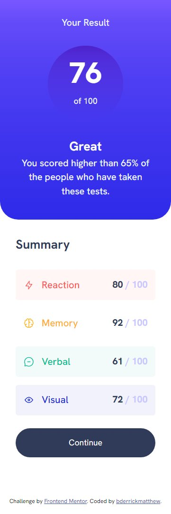
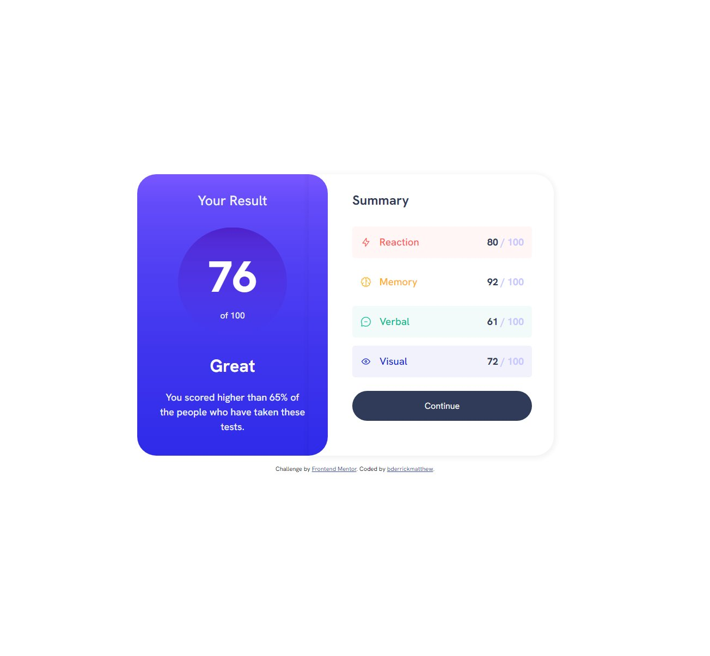

# Frontend Mentor - Results summary component solution

This is a solution to the [Results summary component challenge on Frontend Mentor](https://www.frontendmentor.io/challenges/results-summary-component-CE_K6s0maV). Frontend Mentor challenges help you improve your coding skills by building realistic projects. 

## Table of contents

- [Overview](#overview)
  - [The challenge](#the-challenge)
  - [Screenshot](#screenshot)
  - [Links](#links)
- [My process](#my-process)
  - [Built with](#built-with)
  - [What I learned](#what-i-learned)
  - [Continued development](#continued-development)
  - [Useful resources](#useful-resources)
- [Author](#author)
- [Acknowledgments](#acknowledgments)


## Overview

### The challenge

Users should be able to:

- View the optimal layout for the interface depending on their device's screen size
- See hover and focus states for all interactive elements on the page

### Screenshot





### Links

- Solution URL: [Github Repo](https://github.com/bderrickmatthew/results-summary-component-main)
- Live Site URL: [Github Pages](https://bderrickmatthew.github.io/results-summary-component-main/)

## My process

### Built with

- Semantic HTML5 markup
- CSS custom properties
- Flexbox
- CSS Grid
- Mobile-first workflow

### What I learned

- I learned more of flexbox.
- I also put more into practice of javascript.

- I also learned how to draw a shape i.e a circle using css;

```css
.circle {
    width: 145px;
    height: 145px;
    margin: 30px auto;
    shape-outside: circle();
    clip-path: circle();
    background: linear-gradient(to bottom, var(--violetBlue), 30%,var(--persianBlue));
    padding-top: 10px;
    
}
```


### Continued development

- I look forward to furthering flexbox.
- And how does one style the border-left-top corner of a div just like in the design?

### Useful resources

- [hex 2 rgb(a) && hex 2 hsl(a)](https://tgomilar.github.io/hex2rgb/) - This helped me with colors.
- [Box shadow css generator](https://cssgenerator.org/box-shadow-css-generator.html) - This helped me to generate box shadow.
- [CSS Shapes Explained: How to Draw a Circle, Triangle, and More Using Pure CSS](https://www.freecodecamp.org/news/css-shapes-explained-how-to-draw-a-circle-triangle-and-more-using-pure-css/) - This helped me to to draw a shape particularly a circle.

## Author

- Website - [Soon](https://www.your-site.com)
- Frontend Mentor - [@bderrickmatthew](https://www.frontendmentor.io/profile/bderrickmatthew)
- Twitter - [@bderrickmatthew](https://www.twitter.com/bderrickmatthew])


## Acknowledgments

It was a wonderful challenge, I look forward to the next one.
